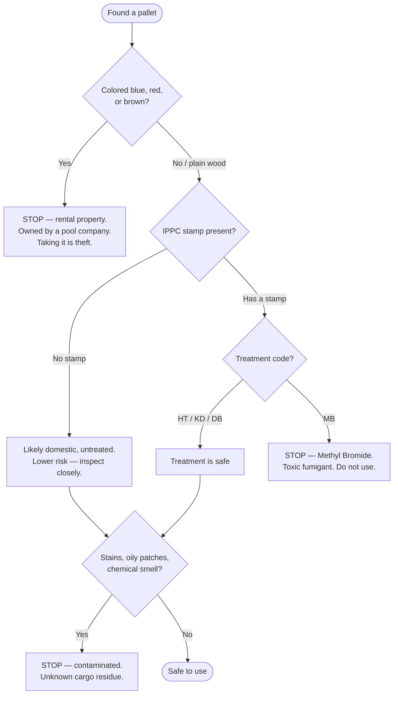

# The Basics

Everything you need to know before the first cut: where to get pallets, how to tell a safe one from a hazardous one, the tools, and how to prep old wood.

---

## Sourcing — where to get pallets

Pallets are one of the few genuinely free building materials. Most businesses **pay** to have them hauled away, so a polite ask usually gets a yes.

**Good places to ask:**

- Hardware stores, garden centers, nurseries
- Furniture and appliance stores
- Pet food / feed / farm-supply stores
- Liquor stores and beverage distributors
- Construction sites (always ask the site manager first)
- Free listings on Facebook Marketplace / Craigslist

**Rules of the road:**

- **Always ask.** Don't take pallets off a property without permission — even if they look abandoned.
- **Ask for the manager.** Front-line staff often can't say yes; managers usually can.
- **Take the good ones.** Don't haul home cracked, soaked, or rotten pallets just because they're free.

---

## Safety — which pallets are safe { #safety-which-pallets-are-safe }

This is the most important section in the guide. A small percentage of pallets are genuinely unsafe, and you need to be able to spot them.

### The IPPC stamp

Pallets used for international shipping carry an **IPPC stamp** (a small logo that looks like a stylized wheat stalk, next to a treatment code). The treatment code is what matters:

| Code | Meaning | Use it? |
|------|---------|---------|
| **HT** | Heat Treated — heated to kill pests, **no chemicals** | ✅ **Yes — safe** |
| **KD** | Kiln Dried — dried, not chemically treated | ✅ Yes |
| **DB** | Debarked — just means bark removed | ✅ Yes (look for HT/KD too) |
| **MB** | **Methyl Bromide** — fumigated with a toxic pesticide | ❌ **NEVER use** |
| *(no stamp)* | Likely a domestic-only pallet; US doesn't require treatment for domestic use | ⚠️ Probably untreated wood — inspect closely |

### The decision flow

### Other safety checks

- **Colored pallets are rental property.** Blue (CHEP), red (PECO / LPR), brown (IPP) pallets belong to rental pool companies. They are not free — taking them is theft. Use plain, unmarked "whitewood" pallets that are genuinely discarded.
- **Contamination.** Skip any pallet with spills, oily stains, strong chemical odors, or unknown residue. A pallet that carried food is very different from one that carried industrial chemicals — and you usually can't tell what it carried, so trust your nose and eyes.
- **Physical hazards.** Protruding nails, splinters, mold, rot. Wear gloves when handling.
- **Dust.** Old reclaimed wood can carry mold spores, dirt, and droppings. **Always wear a dust mask when sanding or cutting.**

---

## Tools

You don't need a full workshop. This is the realistic minimum.

### Deconstruction

| Tool | Why |
|------|-----|
| **Pry bar / wrecking bar** | Separating boards from stringers |
| **Reciprocating saw** (with metal-cutting blades) | The fastest, cleanest way to break pallets down — cut the nails instead of fighting them |
| **Hammer** | Knocking joints apart, punching nails through |
| **Nail punch / pliers / cat's paw** | Removing or sinking old nails |

### Building

| Tool | Why |
|------|-----|
| **Circular saw or miter saw** | Cutting boards to length |
| **Drill / driver** | Pilot holes and driving screws |
| **Orbital sander** + sandpaper (60 / 80 / 120 / 220 grit) | Smoothing rough reclaimed wood |
| **Tape measure, speed square, pencil** | Measuring and marking |
| **Clamps** | Holding pieces while you fasten them |

### Safety gear — not optional

- Work gloves
- Eye protection
- **Dust mask** (especially for sanding)
- Ear protection (for power tools)

---

## Wood prep

Reclaimed pallet wood is not ready to build with straight off the pallet. Prep is half the job.

1. **Remove all fasteners.** Pull or punch out every nail and staple. A single missed nail will ruin a saw blade or a sander pad.
2. **Sort the wood.** Pallet boards vary in thickness, width, and quality. Sort into piles — good faces, structural pieces, scrap. Plan around what you actually have.
3. **Clean.** Brush off dirt and debris. Wipe down. Let damp wood dry fully before building.
4. **Sand in stages.** Start coarse (60–80 grit) to knock down the roughest surface, then step up (120, then 220) for anything that will be touched or seen.
5. **Check for damage.** Set aside cracked, split, rotted, or heavily warped boards. Pallet wood is free — you can afford to be picky.

!!! tip "Measure your real inventory"
    New-lumber plans assume consistent dimensions. Pallet wood doesn't have that. **Design around the wood you actually have**, not around an ideal cut list. See [The Process → Design & Measure](process.md).

---

Next: **[The Process →](process.md)**
